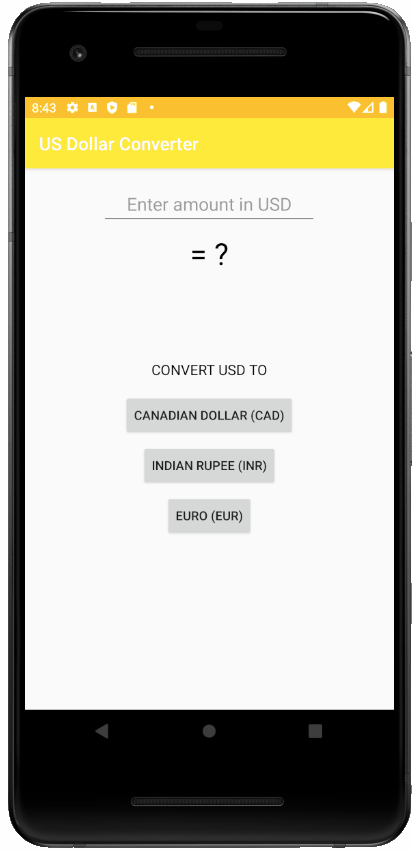

# Android Developer Essentials

Welcome to the Android Developer Essentials workshop series!
Here we will cover all the essential skills needed to build complex, robust, and attractive Android apps.

## 3. US Dollar Converter

Convert USD to any currency!

The sample app we'll make will only support Canadian Dollar (CAD), Indian Rupee (INR), Euro (EUR).
However, you can modify this supported currency list to your liking!

### Screenshots
 

 
 

### Skills Learned

* Android layout
  * More complex ConstraintLayout
  * TextView, EditText, Button
  * Intro to Material Design
* Android coding
  * OnClickListeners
  * findViewById() to programmatically modify views in XML
